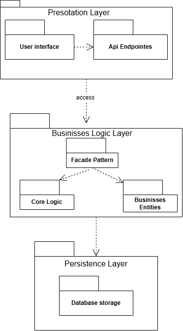

Explanatory Notes1. Layers
Presentation Layer (API):

Handles HTTP requests/responses.

Contains endpoints like UserAPI, PlaceAPI.

Example: POST /users calls User.create() in Business Logic.

Business Logic Layer (Models):

Contains core logic (e.g., User, Place).

Validates data (e.g., "Price must be positive").

Calls Persistence Layer to save data.

Persistence Layer (Database):

Manages database operations via repositories (e.g., UserRepository.save()).

2. Facade Pattern
Purpose: Simplifies interactions between layers.

Example Flow:

UserAPI (Presentation) → Calls → User.create() (Business Logic).

User model → Uses → UserRepository.save() (Persistence).

Database returns success/failure.




# High-Level Package Diagram

```mermaid
classDiagram
    class PresentationLayer {
        <<Interface>>
        +UserAPI
        +PlaceAPI
        +ReviewAPI
        +AmenityAPI
    }

    class BusinessLogicLayer {
        +User
        +Place
        +Review
        +Amenity
    }

    class PersistenceLayer {
        +UserRepository
        +PlaceRepository
        +ReviewRepository
        +AmenityRepository
    }

    PresentationLayer --> BusinessLogicLayer : Uses Facade
    BusinessLogicLayer --> PersistenceLayer : Database Operations
